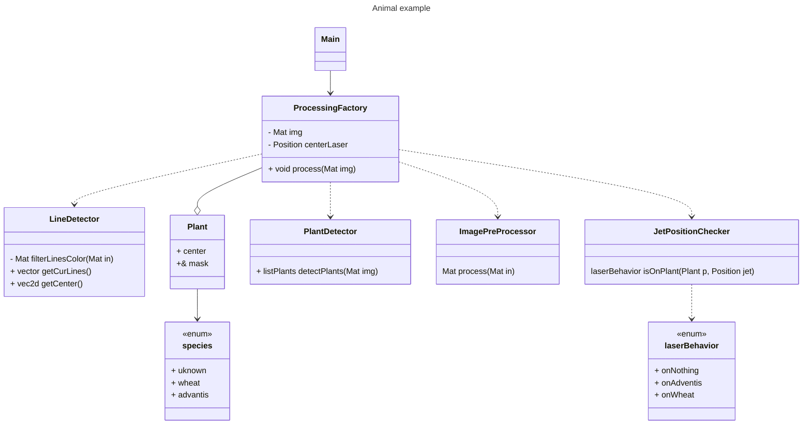

```mermaid
---
title: Animal example
---
classDiagram
    class LineDetector{
        - Mat filterLinesColor(Mat in)
        + vector getCurLines()
        + vec2d getCenter()
    }

    class Plant{
        + center
        +& mask
    }

    class ProcessingFactory{
        - Mat img
        - Position centerLaser
        + void process(Mat img)
    }

    class PlantDetector{
        + listPlants detectPlants(Mat img)
        
    }

    class Main{

    }

    class species{
    <<enum>>
        + uknown
        + wheat
        + advantis
    }

    class ImagePreProcessor{
        Mat process(Mat in)
    }

    class JetPositionChecker{
        laserBehavior isOnPlant(Plant p, Position jet)
    }

    class laserBehavior{
    <<enum>>
        + onNothing
        + onAdventis
        + onWheat
    }

    Plant --> species
    Main --> ProcessingFactory
    ProcessingFactory ..> LineDetector
    ProcessingFactory --o Plant
    ProcessingFactory ..> PlantDetector
    ProcessingFactory ..> ImagePreProcessor
    ProcessingFactory ..> JetPositionChecker
    JetPositionChecker ..> laserBehavior
``` 
