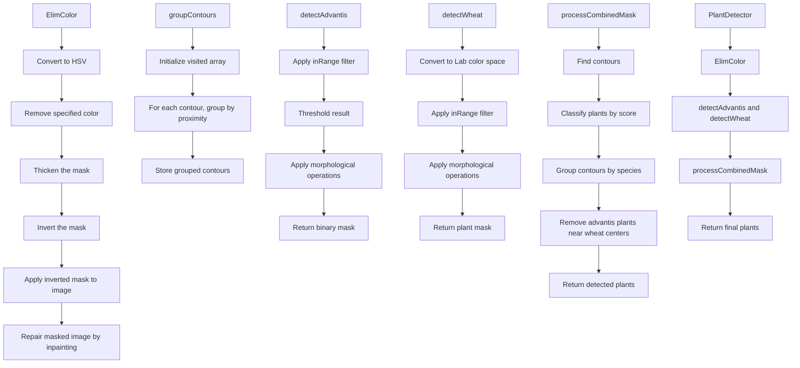

Rapport détaillé sur le fonctionnement du code de détection de plantes
Introduction

Ce rapport a pour objectif de détailler le fonctionnement du code présenté, qui est un programme en C++ utilisant OpenCV pour détecter et classifier des plantes (blé et advantis) dans une image. Le code élimine d'abord les lignes laser de l'image, puis applique diverses techniques de traitement d'image pour segmenter et classer les plantes en fonction de leurs caractéristiques visuelles.
Aperçu du code

Le code est structuré en plusieurs fonctions clés :

ElimColor : Élimine une couleur spécifique de l'image (par exemple, une ligne laser) en utilisant des masques et l'inpainting.
detectAdvantis : Détecte les plantes de type advantis en utilisant des seuils HSV et des opérations morphologiques.
detectWheat : Détecte les plantes de blé en utilisant des seuils dans l'espace couleur Lab et des opérations morphologiques.
groupContours : Regroupe des contours proches en un seul groupe pour représenter une plante.
processCombinedMask : Combine les masques de blé et d'advantis, applique un système de scoring intelligent pour classifier les plantes, et effectue un regroupement conscient des espèces.
PlantDetector::detectPlants : Fonction principale qui orchestre l'ensemble du processus de détection.

Techniques utilisées

Le code utilise plusieurs techniques de traitement d'image et de vision par ordinateur :

Conversion d'espace couleur : Conversion entre les espaces BGR, HSV et Lab pour faciliter la segmentation basée sur la couleur.

Seuiling (inRange) : Création de masques binaires en fonction de seuils de couleur pour segmenter des objets spécifiques.

Opérations morphologiques : Utilisation de l'érosion, la dilatation, l'ouverture et la fermeture pour nettoyer les masques et éliminer le bruit.

Contour Detection : Détection des contours pour identifier les objets individuels dans les masques binaires.

Calcul des moments : Calcul des moments d'un contour pour déterminer le centre de gravité et d'autres propriétés géométriques.

Grouping : Regroupement des contours proches en fonction de la distance pour représenter une seule plante.

Scoring intelligent : Application d'un système de score basé sur des caractéristiques telles que l'aire, la solidité, le rapport d'aspect et la position pour classifier les plantes.

Inpainting : Réparation des régions masquées dans l'image après l'élimination de la couleur indésirable.

Flux logique du programme

Le programme suit le flux logique suivant :

1. Élimination de la ligne laser (ElimColor)

    But : Supprimer une couleur spécifique (ligne laser) de l'image.
    Étapes :
        Conversion de l'image de l'espace BGR à HSV.
        Création d'un masque en utilisant des seuils de couleur.
        Dilatation du masque pour englober la ligne laser entièrement.
        Inversion du masque et application à l'image.
        Réparation des zones masquées en utilisant l'inpainting.

2. Détection des plantes advantis (detectAdvantis)

    But : Créer un masque des plantes advantis en utilisant des seuils HSV.
    Étapes :
        Application de inRange pour obtenir un masque binaire des plantes advantis.
        Application d'une ouverture morphologique pour supprimer le bruit.
        Dilatation pour agrandir les zones détectées.

3. Détection des plantes de blé (detectWheat)

    But : Créer un masque des plantes de blé en utilisant des seuils dans l'espace Lab.
    Étapes :
        Conversion de l'image de l'espace BGR à Lab.
        Égalisation de l'histogramme du canal L pour améliorer le contraste.
        Application de inRange pour obtenir un masque binaire des plantes de blé.
        Inversion du masque pour que les feuilles soient des régions blanches.
        Opérations morphologiques d'ouverture et de fermeture pour nettoyer le masque.

4. Création du masque combiné

    But : Combiner les masques advantis et blé en un seul masque pour faciliter le traitement ultérieur.
    Étapes :
        Application d'un bitwise_or sur les deux masques pour les combiner.

5. Détection des bords (Edge Detection)

    But : Générer un masque des bords pour filtrer les plantes détectées qui n'ont pas de bords significatifs.
    Étapes :
        Conversion de l'image masquée en niveaux de gris.
        Application de l'algorithme de Canny pour détecter les bords.
        Dilatation et érosion pour améliorer le masque des bords.

6. Classification et regroupement des plantes (processCombinedMask)

    But : Classifier les plantes en advantis ou blé en utilisant un système de scoring, et regrouper les contours par espèce.
    Étapes :
        Détection des contours : Utilisation de findContours sur le masque combiné.
        Création des objets ContourInfo : Stockage des informations sur chaque contour, y compris le score et la classification initiale.
        Calcul des caractéristiques :
            Aire du contour.
            Solidité (aire du contour / aire de son enveloppe convexe).
            Rapport d'aspect du rectangle englobant.
            Extent (aire du contour / aire du rectangle englobant).
            Distance par rapport à la ligne centrale de l'image.
        Scoring intelligent : Calcul d'un score basé sur les caractéristiques ci-dessus pour classifier les plantes.
        Reclassification basée sur la proximité : Reclassification des petites plantes de blé proches des advantis en advantis.
        Regroupement des contours : Utilisation de groupContours pour regrouper les contours par espèce.

7. Suppression des advantis proches du blé

    But : Éliminer les plantes advantis situées près du centre des plantes de blé.
    Étapes :
        Pour chaque plante de blé, définir un cercle autour de son centre.
        Si une plante advantis se trouve à l'intérieur de ce cercle, elle est supprimée.

8. Filtrage final des plantes

    But : Supprimer les plantes dont les boîtes englobantes ne chevauchent pas le masque des bords ou qui sont trop grandes.
    Étapes :
        Vérifier l'intersection entre la boîte englobante de chaque plante et le masque des bords.
        Supprimer les plantes sans chevauchement significatif ou dont l'aire est supérieure à un seuil.

9. Résultat

    But : Retourner la liste finale des plantes détectées avec leurs informations associées.

Conclusion

Le code présenté utilise une combinaison de techniques de traitement d'image pour détecter et classifier les plantes dans une image. En exploitant différents espaces de couleur, des opérations morphologiques et un système de scoring intelligent, le programme parvient à distinguer efficacement les plantes de blé des plantes advantis. L'utilisation de masques combinés et de regroupements conscients des espèces permet une détection plus précise et une meilleure représentation des plantes dans l'image.

Le flux logique du programme est bien structuré, avec une séparation claire des différentes étapes du traitement. Les fonctions modulaires permettent une maintenance et une adaptation plus aisées du code pour différents scénarios ou paramètres de détection.
Annexes
Structures de données principales

    AdvantisParams : Contient les paramètres de détection pour les plantes advantis.
    WheatParams : Contient les paramètres de détection pour les plantes de blé.
    ContourInfo : Stocke les informations sur un contour, y compris le contour lui-même, l'espèce, l'aire, le score, la boîte englobante et le centre.
    Plant : Représente une plante détectée avec son image, son masque, sa position, son centre, son espèce et son aire.

Diagramme détaillé du flux de traitement

mermaid

graph TD
A[Chargement de l'image originale] --> B[ElimColor]
B --> C[Image sans ligne laser]
C --> D[detectAdvantis]
C --> E[detectWheat]
D --> F[Masque advantis]
E --> G[Masque blé]
F --> H[Masque combiné]
G --> H
H --> I[Edge Detection]
I --> J[Masque des bords]
H --> K[processCombinedMask]
J --> K
K --> L[Contours détectés]
L --> M[Calcul des caractéristiques et scoring]
M --> N[Classification initiale]
N --> O[Reclassification basée sur la proximité]
O --> P[Regroupement des contours par espèce]
P --> Q[Suppression des advantis proches du blé]
Q --> R[Filtrage final des plantes]
R --> S[Liste des plantes détectées]

Remarques supplémentaires

    Paramètres ajustables : Le code prévoit des paramètres ajustables pour affiner la détection, tels que les seuils de couleur, les tailles de noyau morphologique et les paramètres de scoring.
    Interface interactive : Si enableSliders est activé, le programme affiche des fenêtres avec des curseurs pour ajuster les paramètres en temps réel, ce qui est utile pour le débogage et le réglage fin.
    Optimisations potentielles : L'utilisation de techniques plus avancées, comme l'apprentissage automatique, pourrait améliorer la précision de la classification.

